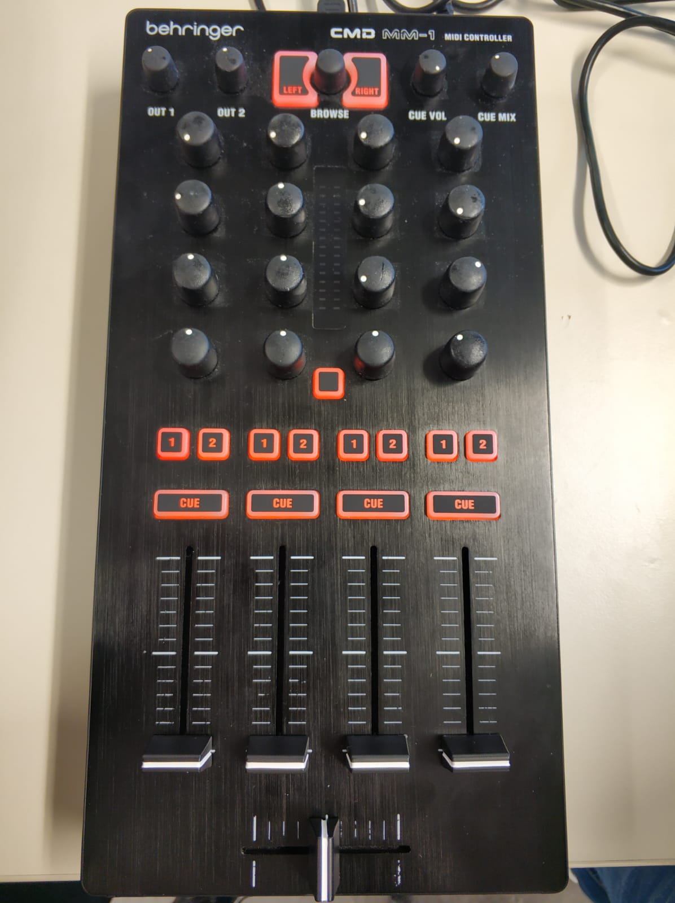

# PIMP MY SOUND

Im Rahmen der Projektarbeit des Moduls "Audio-und Videotechnik" ist Pimp My Sound entstanden, welches von Dennis Hiller, Dat Tony Nguyen Tien, Alihan Atmaca und Ai-Hong Ky entwickelt wurde.


  
Das Team während der gemeinsamen Arbeit am Projekt.

## Inhalt

1. [Projektidee](#projektidee)
2. [Installationanleitung](#installationsanleitung)
3. [Benutzeranleitung](#benutzeranleitung)
4. [Tastenbelegung](#tastenbelegung)
5. [Verwendete Technologien](#verwendete-technologien)
6. [Technische Projektbeschreibung](#technische-projektbeschreibung)
7. [Quellen](#quellen)

## Projektidee

Die grundsätzliche Idee bestand darin, einen einfachen Web-Audio-Player/DJ Tool zu entwickeln, welchen man neben der Tastatur auch mit einem Midi-Controller steuern kann. Dieser Player soll zwei verschiedene Audio Dateien laden und diese gleichzeitig bearbeiten können. 

## Installationsanleitung

Voraussetzungen:
- [Node.js](https://nodejs.org/en/)
- [Vue.js](https://vuejs.org/)

### Node.js Installation

#### Ubuntu

Die Installation erfolgt über das Terminal, welches mit Strg+ALT+T aufgerufen werden kann.

##### 1. Schritt: Systemupdate
```
sudo apt update
```
##### 2. Schritt: Installation Node.js
```
sudo apt install nodejs
```
##### 3. Schritt: Installation NPM
```
sudo apt install npm
```
##### 4. Schritt: Installationsüberprüfung
```
nodejs -v
npm -v
```
#### MacOS & Windows

MacOS und Windows Installer findet man hier: [Nodejs.org](https://nodejs.org/en/download/).

### Vue.js Installation

#### Ubuntu

Weiterhin im Terminal wird folgender Befehl zur Vue.js Installation ausgeführt.

```
npm install -g @vue/cli
```

#### MacOS 

Um Vue.js auf MacOS zu installieren, im Terminal folgenden Befehl ausführen:

```
npm i -g vue-cli eslint 

```
### Projektausführung

Nun kann im Projektordner mit folgenden Befehlen alle benötigten Abhängigkeiten installieren:

```
npm install
```

Um nun das Projekt zu starten kann folgender Befehlt ausgeführt werden:

```
npm run serve
```
Das Projekt sollte sich jetzt unter der URL http://localhost:8080 im Browser befinden.

## Benutzeranleitung

Mit Pimp My Sound können zwei verschiedene Audio-Dateien nach Lust und Laune mit verschiedenen Funktionen manipuliert werden. Der Nutzer kann seiner kreativen Ader freien Lauf lassen.

Die Bearbeitung der geladenen Dateien erfolgt entweder über die Maus oder einen Midi-Controller. Zu Beginn müssen eventuell weitere Audio-Dateien hochgeladen werden. Dies geschieht über die File-Input-Bar, wo man lokal auf seinem Rechner nach .wav, .mp3, .m4a -Dateien suchen kann und diese dann per "Add Track"-Button der Bibliothek hinzufügen soll. Anschließend kann man eine Datei in der Liste anklicken oder per Midi-Controller auswählen und der Linken oder Rechten Seite der Berarbeitungsfenstern hinzufügen. Nun erscheint zur Audio-Datei die entsprechende Soundtrack Visualisierung. 

Nun kann man die Audio-Dateien mit dem Play-Button abspielen, mit dem Pause-Button pausieren und mit dem Stop-Button beenden. Außerdem gibt es zusätzlich den "x0.5"-Button, der die Wiedergabe um 0.5 verlangsamt und einen "x1.5"-Button, welcher die Wiedergabe wiederum um 1.5 beschleunigt. Des weiteren kann die Lautstärke über den Volume-Slider angepasst werden. Zudem gibt es einen Crossfader mit dem man die Möglichkeit hat, die zwei Audio-Dateien ineinander überlaufen zu lassen.

Um Die Dateien nun zu bearbeiten, kann man verschiedene Filter benutzen wie z.B. Lowshelf, Peaking und Highshelf.

Die Shelf-Filter besitzen die sogenannte Cutoff Frequency. Alle Frequenzen über bzw. unter dieser gegebenen Frequenz werden mit dem gegebenen Gain-Value verstärkt oder geschwächt.

Der Peaking-Filter ist in der Lage Frequenzen um die gegebene Frequenz zu verstärken oder auch zu schwächen, je nach Gain Value. Der Quality-Faktor beschreibt bei diesem Filter die Breite des Frequenzbandes.

## Tastenbelegung

Ist die Nutzung des Audio-Players mit einem Midi-Controller erwünscht, so ...


  
## Verwendete Technologien

- Web-Technologien
	 - [JavaScript](https://www.javascript.com/)
	 - [HTML](https://www.w3schools.com/html/)
	 - [CSS](https://www.w3schools.com/css/)
 - Frameworks
	 - [Vue.js](https://vuejs.org/)
 - Schnittstellen 
   - [Node.js](https://nodejs.org/en/)
   - [Musical Instrument Digital Interface (MIDI)](https://de.wikipedia.org/wiki/Musical_Instrument_Digital_Interface) 
 - Bibliotheken
	 - [Bootstrap](https://getbootstrap.com/)

## Technische Projektbeschreibung

Es wurde gemeinsam entschieden mit dem JavaScript-Webframework Vue.js zu arbeiten, da Vue.js mit Komponenten arbeitet. Jede Komponente ist sozusagen eine Klasse, die jeweils HTML, CSS und Javascript enthalten. Zusätzlich wird eine Hauptkomponente verwendet, die alle States verwaltet und von der alle anderen Komponenten ausgehen.
Vue.js eignet sich also besonders wenn Komponenten unabhängig von anderen Komponenten entwickelt werden sollen.

Im folgenden werden die verschiedenen Komponenten dieses Projektes genannt und kurz erläutert.

#### Komponenten:

- **App**
  - Hauptkomponente, die alle anderen Komponenten enthält
  - Verwaltet die Zustände
- **AudioPlayer**
  - Funktionen: Play-, Pause-, Stop-, x0.5-, x1.5- Button; 
  - Lädt Komponenten: AudioFilter, VolumeSlider, Soundtrack
- **AudioFilter**
  - eine dynamische Komponente die unter gegebener Konfiguration im Template jeder möglicher Filter sein kann
  - [hier welche Filter möglich sind](https://developer.mozilla.org/en-US/docs/Web/API/BiquadFilterNode)
- **Crossfader**
  - Enthält die Funktionen, die es möglich machen zwei Audio-Dateien ineinander überlaufen zu lassen
- **FileList**
  - Enthält die File-Input-Bar, mit der Audio Dateien hochgeladen werden können, die direkt in die Library geladen     werden und die Funktion durch die Liste zu gehen und eine Datei in den jeweiligen Container zum                   bearbeiten zu schieben
- **InputManager**
  - Anbindung an den Midi-Controller
- **PimpMySound**
  - Titel
- **Soundtrack**
  - Visualisierung der Audio-Dateien
- **VolumeSlider**
  - Regelt die Lautstärke der geladenen Audio-Dateien
  
  ## Quellen
  
  - https://vuejs.org/v2/guide/
  - https://getbootstrap.com/docs/4.4/getting-started/introduction/
  - https://bootstrap-vue.js.org/docs
  

