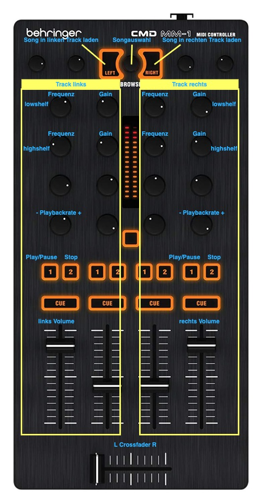

# PIMP MY SOUND

Im Rahmen der Projektarbeit des Moduls "Audio-und Videotechnik" ist "Pimp My Sound" entstanden, welches von Dennis Hiller, Dat Tony Nguyen Tien, Alihan Atmaca und Ai-Hong Ky entwickelt wurde.


  
Das Team während der gemeinsamen Arbeit am Projekt.


## Inhalt

1. [Projektidee](#projektidee)
2. [Installationanleitung](#installationsanleitung)
3. [Benutzeranleitung](#benutzeranleitung)
4. [Tastenbelegung](#tastenbelegung)
5. [Verwendete Technologien](#verwendete-technologien)
6. [Technische Projektbeschreibung](#technische-projektbeschreibung)
7. [Quellen](#quellen)


## Projektidee

Die grundsätzliche Idee bestand darin einen einfachen Web-Audio-Player/DJ Tool zu entwickeln, welchen man neben der Tastatur auch mit einem Midi-Controller steuern kann. Dieser Player soll zwei verschiedene Audio Dateien laden und diese gleichzeitig bearbeiten können. 


## Installationsanleitung

Voraussetzungen:
- [Node.js](https://nodejs.org/en/)
- [Vue.js](https://vuejs.org/)


### Node.js Installation

#### Ubuntu

Die Installation erfolgt über das Terminal, welches mit Strg+ALT+T aufgerufen werden kann.

##### 1. Schritt: Systemupdate
```
sudo apt update
```
##### 2. Schritt: Installation Node.js
```
sudo apt install nodejs
```
##### 3. Schritt: Installation NPM
```
sudo apt install npm
```
##### 4. Schritt: Installationsüberprüfung
```
nodejs -v
npm -v
```
#### MacOS & Windows

MacOS und Windows Installer findet man hier: [Nodejs.org](https://nodejs.org/en/download/).


### Vue.js Installation

#### Ubuntu

Weiterhin im Terminal wird folgender Befehl zur Vue.js Installation ausgeführt.

```
npm install -g @vue/cli
```

#### MacOS 

Um Vue.js auf MacOS zu installieren, im Terminal folgenden Befehl ausführen:

```
npm i -g vue-cli eslint 

```

### Projektausführung

Nun kann im Projektordner mit folgenden Befehlen alle benötigten Abhängigkeiten installieren:

```
npm install
```

Um nun das Projekt zu starten kann folgender Befehlt ausgeführt werden:

```
npm run serve
```
Das Projekt sollte sich jetzt unter der URL http://localhost:8080 im Browser befinden.


## Benutzeranleitung

Mit "Pimp My Sound" können zwei verschiedene Audio-Dateien nach Lust und Laune mit verschiedenen Funktionen manipuliert werden. Der Nutzer kann seiner kreativen Ader hierbei freien Lauf lassen.

Die Bearbeitung der geladenen Dateien erfolgt entweder über die Maus oder einen Midi-Controller. Zu Beginn müssen eventuell weitere Audio-Dateien hochgeladen werden. Dies geschieht über die File-Input-Bar, wo man lokal auf seinem Rechner nach .wav, .mp3, .m4a -Dateien suchen kann und der Bibliothek hinzufügen soll. Anschließend kann man eine Datei in der Liste anklicken oder per Midi-Controller auswählen und der Linken oder Rechten Seite der Berarbeitungsfenster hinzufügen. Nun erscheint zur Audio-Datei die entsprechende Soundtrack Visualisierung. 

Die Audio-Dateien kann man mit dem Play-Button abspielen, mit dem Pause-Button pausieren und mit dem Stop-Button beenden. Außerdem gibt es zusätzlich den "x0.5"-Button, der die Wiedergabe um 0.5 verlangsamt und einen "x1.5"-Button, welcher die Wiedergabe wiederum um 1.5 beschleunigt. Des Weiteren kann die Lautstärke über den Volume-Slider angepasst werden. Außerdem gibt es einen Crossfader der es ermöglicht, die zwei Audio-Dateien ineinander überlaufen zu lassen.

Um Die Dateien nun zu bearbeiten, kann man nun verschiedene Filter benutzen wie z.B. Lowshelf, Peaking und Highshelf. Aufgrund der begrenzten Möglichkeit der Kontrollelemente mit dem gegebenen MIDI-Controller, lassen sich nicht alle Filter mit diesem steuern. Die Steuerung selbst, ist im folgenden Punkt erklärt.

Dem Low-/Highshelf-Filter wird eine Frequenz übergeben. Alle Frequenzen über bzw. unter dieser gegebenen Frequenz werden mit dem gegebenen Gain-Value verstärkt oder geschwächt.

Der Peaking-Filter ist in der Lage Frequenzen um die gegebene Frequenz zu verstärken oder auch zu schwächen - je nach Gain Value. Der Quality-Faktor beschreibt bei diesem Filter die Breite des Frequenzbandes.

Der Low-/Highpass-Filter besitzen eine Cutoff Frequency. Alle Frequenzen über bzw. unter dieser Frequenz werden herausgefiltert/abgeschnitten. 

Der Notch-Filter wird eine Frequenz als Mitte seines Bandes übergeben. Frequenzen innerhalb dieses Bandes werden herausgefiltert. Sprich nur noch Frequenzen außerhalb dessen bleiben erhalten. Der Quality-Faktor beschreibt die Breite dieses Bandes.


## Tastenbelegung Midi-Controller(Behringer CMD MM-1)




## Verwendete Technologien

- Web-Technologien
	 - [JavaScript](https://www.javascript.com/)
	 - [HTML](https://www.w3schools.com/html/)
	 - [CSS](https://www.w3schools.com/css/)
 - Frameworks
	 - [Vue.js](https://vuejs.org/)
 - Schnittstellen 
   - [Node.js](https://nodejs.org/en/)
   - [Musical Instrument Digital Interface (MIDI)](https://de.wikipedia.org/wiki/Musical_Instrument_Digital_Interface) 
 - Bibliotheken
	 - [Bootstrap](https://getbootstrap.com/)


## Technische Projektbeschreibung

Es wurde gemeinsam entschieden mit dem JavaScript-Webframework Vue.js zu arbeiten, da das Framework uns erlaubt komponentenbasiert zu entwickeln. Jede Komponente beschreibt ein in sich unabhängiges Modul mit Scoped Html, Css und JS. In der Hauptkomponente müssen diese Komponenten schließlich, dem Builder-Prinzip folgend, nur noch zusammengesetzt werden. Besonderer Vorteil des Frameworks ist das Mappen des User Interfaces zu bestimmten Variablen (Zuständen der Applikation), welches mit VanillaJS sehr unübersichtlich und fehleranfälliger gewesen wäre.  

Im folgenden werden die verschiedenen Komponenten dieses Projektes genannt und kurz erläutert.

#### Vue Komponenten:

- **App**
  - Hauptkomponente, die Komponenten enthält und zusammensetzt
- **AudioPlayer**
  - Funktionen: Play-, Pause-, Stop-, x0.5-, x1.5- Button; 
  - Lädt für sich die Komponenten: AudioFilter, VolumeSlider, Soundtrack
- **AudioFilter**
  - eine dynamische Komponente die unter gegebener Konfiguration im Template jeder möglicher Filter sein kann
  - [hier welche Filter möglich sind](https://developer.mozilla.org/en-US/docs/Web/API/BiquadFilterNode)
- **Crossfader**
  - Enthält die Funktionen, die es möglich machen zwei Audio-Dateien ineinander überlaufen zu lassen
- **FileList**
  - Enthält die File-Input-Bar, mit der Audio Dateien hochgeladen werden können, die direkt in die Library geladen werden
  - die Funktion durch die Liste zu gehen und eine Datei in den jeweiligen Container fürs weitere Bearbeiten zu schieben
- **InputManager**
  - Anbindung an den Midi-Controller
- **PimpMySound**
  - Titel
- **Soundtrack**
  - Visualisierung der Audio-Dateien
- **VolumeSlider**
  - Regelt die Lautstärke der geladenen Audio-Dateien
- **Main**
  - besitzt globale Objekte, die ggf. zu importieren sind: EventBus, AudioCtx, AudioCtx2
  
  
## Quellen

- https://vuejs.org/v2/guide/
- https://getbootstrap.com/docs/4.4/getting-started/introduction/
- https://bootstrap-vue.js.org/docs
  
